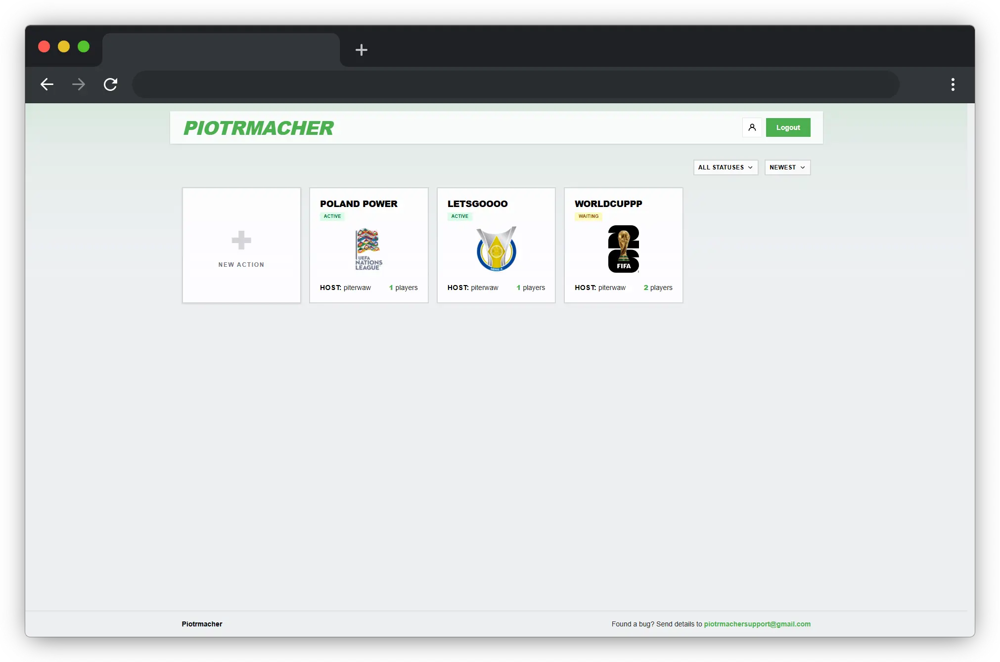
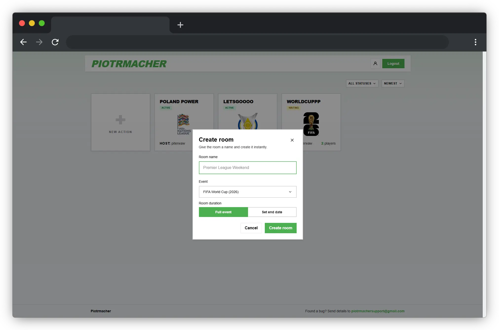
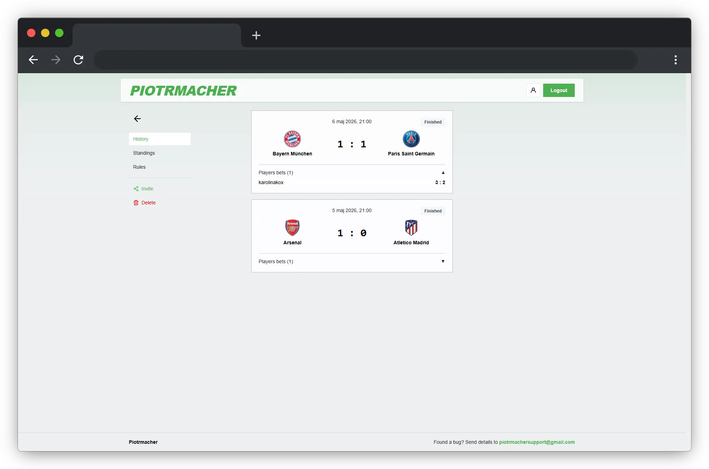
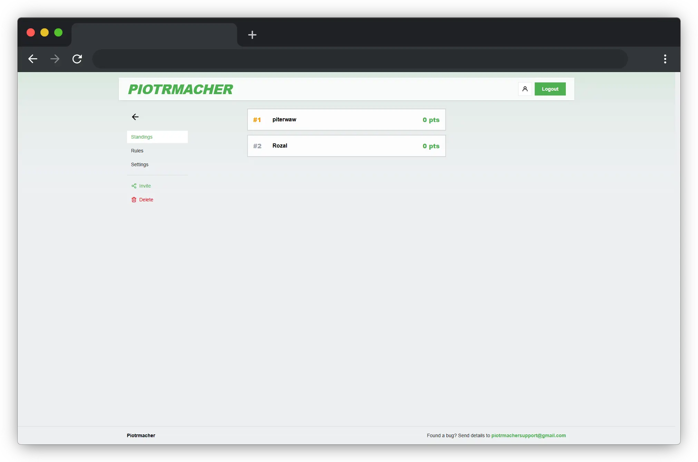

# Piotrmacher

**[piotrmacher.fun](https://piotrmacher.fun)**

A score prediction app I built for playing typer with friends during football tournaments. You create a private room, share an invite code, everyone picks scores before each match — points stack up automatically as results come in.

## Features

- create rooms tied to a specific event (World Cup, Nations League, etc.)
- lock in score predictions before kick-off
- automatic scoring after each match — correct winner, exact score, goal difference, all configurable
- pick-em: predict group stage standings before the tournament starts
- live leaderboard and full bet history per room

## Tech

Next.js 16, Supabase (Postgres + Auth), Tailwind CSS v4, deployed on Vercel with cron jobs for match sync and scoring.

## Run locally

```bash
npm install
cp .env.example .env.local
npm run dev
```

Schema is in [`schema.sql`](./schema.sql) — paste it into the Supabase SQL editor on a fresh project.

## Screenshots








